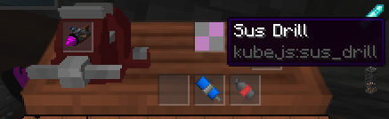

# DynamicJS

A (maybe) maintained, (partially) typed and (should be) production-ready dynamic class generator
for KubeJS, powered by ByteBuddy.

DynamicJS allows you to create Java class dynamically at runtime via KubeJS, the class created
can inherit any class, implement any interface, and override/implement methods declared by those
classes/interfaces.

This means that it's possible for you to make custom items that implement certain interface,
like `IDrillHead` in Immersive Engineering, which turns the item into a drill head usable by IE's
oil drill:

```js
StartupEvents.registry("item", event => {
    /**
     * @type {Internal.IDrillHead}
     */
    let $IDrillHead = Java.loadClass("blusunrize.immersiveengineering.api.tool.IDrillHead")
    let $Tiers = Java.loadClass("net.minecraft.world.item.Tiers")
    let $ImmutableList = Java.loadClass("com.google.common.collect.ImmutableList")

    let $Foo = DynamicClass
        //Inherits from the item class
        .wraps(Java.loadClass("net.minecraft.world.item.Item"))
        //Can override everything in the original class
        .override("getMod", callinfo => callinfo.parent.getMod())
        //Declare that we need to implement such interface for this class,
        //and implement everything we need in declared interfaces...
        .impl($IDrillHead, implementation => implementation
            .override("beforeBlockbreak", callinfo => { })
            .override("afterBlockbreak", callinfo => { })
            //Return type will be converted by Rhino, but sometimes it might fail
            .override("getExtraBlocksDug", callinfo => $ImmutableList.of())
            .override("getMiningLevel", callinfo => $Tiers.WOOD)
            .override("getMiningSpeed", callinfo => {
                return callinfo.args[0].getOrCreateTag().getInt("sus") + 1
            })
            .override("getAttackDamage", callinfo => 100)
            .override("getHeadDamage", callinfo => 0)
            .override("getMaximumHeadDamage", callinfo => 1000)
            .override("damageHead", callinfo => {
                /**
                 * @type {Internal.ItemStack}
                 */
                let stack = callinfo.args[0]
                let susAmount = stack.getOrCreateTag().getInt("sus")
                stack.nbt.putInt("sus", susAmount + 1)
            })
            .override("getDrillTexture", callinfo => new ResourceLocation("kubejs", "sus"))
        )
        //Build the class to get everything done
        .build()

    let inst = new $Foo(new $ItemProperties()
        .tab(CREATIVE_TABS["kubejs.kubejs"])
        .stacksTo(1))
    console.info(inst.getClass())
    console.info(inst.getMod())
    console.info(inst instanceof $IDrillHead)
    event.custom("sus_drill", inst)
})
```

Will give you:

<center>

<figcaption>Yes, a sussy drill.</figcaption>
</center>

Installation of ProbeJS is highly recommended, as there are internal docs describing detail type
hinting for every method and parameter. Actually, there's even completion for method names you
need to override!

The type hinting of arg lists in callback is not done yet, but after some time, it should be
implemented as ProbeJS will have an update in docs handling.